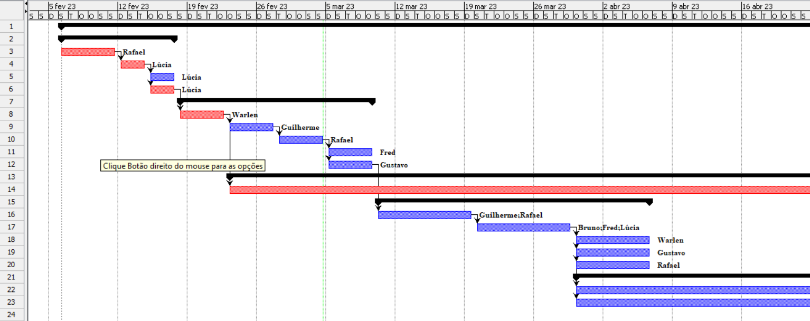

# Especificações do Projeto

Pré-requisitos: <a href="1-Documentação de Contexto.md"> Documentação de Contexto</a>

Definição do problema e ideia de solução a partir da perspectiva do usuário. É composta pela definição do  diagrama de personas, histórias de usuários, requisitos funcionais e não funcionais além das restrições do projeto.

Apresente uma visão geral do que será abordado nesta parte do documento, enumerando as técnicas e/ou ferramentas utilizadas para realizar a especificações do projeto

## Personas

As Personas do projeto foram construídas a partir de entrevistas individuais, suas histórias têm envolvimento tanto direto como indiretamente com o tema proposto para construção desse trabalho. Com as informações coletadas poderemos ter uma diversidade de visões no qual nos permitirá entender melhor cada usuário. Abaixo iremos relatar a história das pessoas entrevistadas.

|    Jessica Alencar | Informações:                       |                                        |
|--------------------|------------------------------------|----------------------------------------|
|| **Idade:** 26 anos   **Ocupação:** Personal traine|**Aplicativos:** <ul>● Instagram  ● Linkedin  ● Telegram ● WhatsApp  </ul>|
|**Motivações:** <ul>● Criação treino facilitado.   ● Ganho tempo. </ul>|**Frustrações:** <ul>● Muito tempo é perdido;   ● Levo muito tempo buscando exercícios e escrevendo-os a mão.   |**Hobbies/Histórias:** <ul>● Preciso de mais tempo livre  ● Levo muito tempo escrevendo exercicio  ● Levo muito tempo buscando exercicio  </ul>|

|   Maria Teresa | Informações:                       |                                        |
|--------------------|------------------------------------|----------------------------------------|
|| **Idade:** 32 anos   **Ocupação:** Proprietária de academia|**Aplicativos:** <ul>● Instagram  ● Linkedin  ● Telegram ● WhatsApp  </ul>|
|**Motivações:** <ul>● Criação treino maneira digital.   ● criar sistema exclusivo. </ul>|**Frustrações:** <ul>● Custo projeto;   ● impacto ambiental fichas de papel.   |**Hobbies/Histórias:** <ul>● Ambientalista  ● Reduzir o impacto ambiental  ● Academia sustentavel  </ul>|

|   Paulo Santos | Informações:                       |                                        |
|--------------------|------------------------------------|----------------------------------------|
|| **Idade:** 20 anos   **Ocupação:** Aluno de academia|**Aplicativos:** <ul>● Instagram  ● Linkedin  ● Telegram ● WhatsApp  </ul>|
|**Motivações:** <ul>● Receber treino no celular.   ● Praticidade. </ul>|**Frustrações:** <ul>● Encontrar uma aplicação;   ● Perco minha ficha direto.   |**Hobbies/Histórias:** <ul>● Musculação  ● Corrida  ● Natação  </ul>|

|   João Ricardo | Informações:                       |                                        |
|--------------------|------------------------------------|----------------------------------------|
|| **Idade:** 59 anos   **Ocupação:** Educador físico|**Aplicativos:** <ul>● Instagram  ● Linkedin  ● Telegram ● WhatsApp  </ul>|
|**Motivações:** <ul>● Quero compartilhar meus treinos.   ● Otimizar meu tempo. </ul>|**Frustrações:** <ul>● Levo muito tempo escrevendo fichas;   ● Excesso papel na mochila.   |**Hobbies/Histórias:** <ul>● Tenho alunos de outros estados  ● Preciso enviar o mesmo treino para varios alunos  ● Quero evoluir a forma como se faz fichas de treino  </ul>|

## Histórias de Usuários

A partir das informações passadas pelas Personas acima, foram registradas as seguintes histórias de usuários.

|EU COMO... `PERSONA`| QUERO/PRECISO ... `FUNCIONALIDADE` |PARA ... `MOTIVO/VALOR`                 |
|--------------------|------------------------------------|----------------------------------------|
|Jessica Alencar      | criar um treino de maneira mais rápida. | Ganhar tempo ao fazer o treino. |
|Maria teresa       | Criar treinos de maneira digital. | Reduzir o impacto ambiental gerado com as folhas. |
|Paulo Santos      | Receber meu treino via whats app. | Acessar o treino de maneira otimizada |
|João Ricardo      | Compartilhar os treinos com meus alunos  | Reduzir o tempo que levo escrevendo e enviando os treinos.|

## Modelagem do Processo de Negócio 

### Análise da Situação Atual

Nossa proposta é a criação de uma plataforma onde viabilize a criação de treinos personalizados e exclusvivos feito por profissionais da área para seus respectivos alunos, Vendo que um grande problema enfrentado hoje, é o grande impacto que a geração de papel tem feito ao meio ambiente, pensando nisso criamos a ideia de tornar essa ficha digital economizando papel e poluindo menos o meio ambiente.

### Descrição Geral da Proposta

A aplicação visa a criação de uma plataforma para a montagem de treinos de maneira digital, as possiveis melhorias são a implementação de outros tipos de treinos como: Funcional,Aerobico, Lutas entre outros.

### Processo 1 – INTERAÇÃO ACADEMIA

Esse diagrama representa a interação anterior a chegada até a aplicação.

 

### Processo 2 – PROCESSO CRIAÇÃO FICHA

Esse diagrama representa a interação e os procesos executados dentro da plataforma.

## Indicadores de Desempenho

| # | Indicador |  Objetivos| Descrição |Cálculo | Fonte | Perspectiva |
|---|-|---------- |---------|-|--------|-------|
|001| Número de personais traine cadastrados| Promover maior numero de usuarios da plataforma |Contabilizar a média de usuarios com base no número de novos usuarios cadastrados| Média de novosusuarios| Banco de dados do projeto | Aumentar usuarios da plataforma|
|002| Número de treinos cadastrados | avaliar a quantidade de treinos que estão sendo efetivados |Calcular porcentagem de treinos finalizados e não finalizados | Quantidade de treinos criados vs treinos não finalizados  | Banco de dados do projeto | Conter uma taxa de finalizações maiores que não finalizados|   
|003| Taxa de reclamações de falhas na aplicação | Avaliar quantitativamente as falhas decorrentes da aplicação | Porcentagem de reclamações com relação as falhas na aplicação  | Número de reclamaçoes/ número de usuarios *100  | Tabela reclamações  | Aprendizado e melhorias |  
|004| Número de downloads  | Aumentar a taxa de crescimento da aplicação  | Avaliar a taxa de downloads realizados   | Média do número de downloads por mês  | Estátisticas fornecidas pela Playstore/AppleStore | Aumentar a taxa de crescimento do app 10% ao mês   |  
|005| Número de desinstalações do aplicativo | Diminuir o  número de desinstalações | Avaliar o que precisa ser mudado no Aplicativo para evitar futuras desinstalações | Média do número de desinstalações realizadas por mês  | Estátisticas fornecidas pela Playstore/AppleStore | Diminuir  o número de desinstalações em 20%.  |   
|006| Nota do Aplicativo  | Aumentar a nota de satisfação do usuário | Verificar a nota do App exibida aos usuários  | Calculada com base nas notas mais recente  | Estátisticas fornecidas pela Playstore/AppleStore | Aumentar a nota do Aplicativo para 5 estrelas.  |   

## Requisitos

Existem 2 etapas de produção para a conclusão do produto. Devemos construir uma API Rest, que será responsável pela integração dos dados com o cliente e o App Mobile, onde o usuário realizará as requisições HTTP para o servidor, que deverá enviar as respostas. Tratamento de exceções (eventos anormais que interrompem a execução do programa) devem ser feitos no servidor e no cliente, para que o usuário final tenha uma experiência agradável e com um aplicativo de fácil utilização.

### Requisitos Funcionais - API Rest

A tabela a seguir apresenta os requisitos da API, identificando a prioridade em que os mesmos devem ser entregues.

|ID    | Descrição do Requisito  | Prioridade |
|------|-----------------------------------------|----|
|RF-001| A api deve poder receber solicitações HTTP do cliente e responder com dados correspondentes | ALTA | 
|RF-002| A api deve ter as operações de CREATE, READ, UPDATE e DELETE   | MÉDIA |
|RF-003| A api deve ser capaz de autenticar e autorizar usuários a acessar diferentes recursos  | MÉDIA |
|RF-004| A api deve ter tratamento de erros com base no status da resposta HTTP  | MÉDIA |
|RF-005| A api deve ser capaz de lidar com solicitações mais complexas, como capturar dados via ID  | MÉDIA |

### Requisitos não Funcionais - API Rest

A tabela a seguir apresenta os requisitos não funcionais que a API deverá atender.

|ID     | Descrição do Requisito  |Prioridade |
|-------|-------------------------|----|
|RNF-001| A api deve ter um tempo de resposta adequado| MÉDIA | 
|RNF-002| Todas as senhas devem ser encriptadas no banco de dados |  ALTA | 
|RNF-003| A api deve ser segura e proteger os dados do usuário contra acesso não autorizado |  MEDIA | 
|RNF-004| Api deve ser fácil para os desenvolvedores trabalharem |  BAIXA | 
|RNF-005| A api deve ser documentada de forma clara e de fácil entendimento |  MÉDIA | 

### Requisitos Funcionais - App Mobile

A tabela a seguir apresenta os requisitos do App Mobile, identificando a prioridade em que os mesmos devem ser entregues.

|ID    | Descrição do Requisito  | Prioridade |
|------|-----------------------------------------|----|
|RF-001| O aplicativo deve ser capaz de funcionar em diferentes sistemas operacionais móveis (Android, iOS) | ALTA | 
|RF-002| O aplicativo deve ser capaz de permitir o usuário registrar uma conta | ALTA | 
|RF-003| O aplicativo deve ser capaz de permitir o fazer login | ALTA | 
|RF-004| O aplicativo deve fazer a validação dos dados antes de finalizar a requisição para o servidor | ALTA | 
|RF-005| O aplicativo deve redirecionar o usuário autenticado para a página inicial | ALTA | 
|RF-006| O aplicativo deve permitir que o usuário leia todos os exercícios listados | MÉDIA | 
|RF-007| O aplicativo deve permitir que o usuário leia espicificações de um exercício | MÉDIA | 
|RF-008| O aplicativo deve permitir que o usuário selecione mais de um exercício | MÉDIA | 
|RF-009| O aplicativo deve oferecer opções de confirmação antes de realizar uma ação que o usuário esteja solicitando | MÉDIA | 
|RF-010| O aplicativo deve permitir que o usuário faça logout | MÉDIA | 
|RF-011| O aplicativo deve permitir que o usuário envie seus treinos por um arquivo PDF | ALTA | 

### Requisitos não Funcionais - App Mobile

A tabela a seguir apresenta os requisitos não funcionais que o App Mobile deverá atender.

|ID     | Descrição do Requisito  |Prioridade |
|-------|-------------------------|----|
|RNF-001| O aplicativo deve ser fácil de usar e ter uma interface de usuário atraente| MÉDIA | 
|RNF-002| O aplicativo deve ter um tempo de resposta rápido e consistente. |  ALTA | 
|RNF-003| O aplicativo deve ter um consumo de recursos (bateria e dados móveis) baixo. |  MEDIA | 
|RNF-004| O aplicativo deve ser seguro e proteger os dados do usuário contra acessos não autorizados|  ALTA | 

## Restrições

As questões que limitam a execução desse projeto e que se configuram como obrigações claras para o desenvolvimento do projeto em questão são apresentadas na tabela a seguir.

|ID| Restrição                                             |
|--|-------------------------------------------------------|
|01| O projeto deverá ser entregue até o final do semestre |
|02| O aplicativo deve ter funcionalidades básicas que possam ser feitas no prazo estipulado     |
|03| A equipe não pode subcontratar o desenvolvimento do trabalho.     |

Enumere as restrições à sua solução. Lembre-se de que as restrições geralmente limitam a solução candidata.

## Diagrama de Casos de Uso

O diagrama de casos de uso é o próximo passo após a elicitação de requisitos, que utiliza um modelo gráfico e uma tabela com as descrições sucintas dos casos de uso e dos atores. Ele contempla a fronteira do sistema e o detalhamento dos requisitos funcionais com a indicação dos atores, casos de uso e seus relacionamentos. 

As referências abaixo irão auxiliá-lo na geração do artefato “Diagrama de Casos de Uso”.

> **Links Úteis**:
> - [Criando Casos de Uso](https://www.ibm.com/docs/pt-br/elm/6.0?topic=requirements-creating-use-cases)
> - [Como Criar Diagrama de Caso de Uso: Tutorial Passo a Passo](https://gitmind.com/pt/fazer-diagrama-de-caso-uso.html/)
> - [Lucidchart](https://www.lucidchart.com/)
> - [Astah](https://astah.net/)
> - [Diagrams](https://app.diagrams.net/)

# Matriz de Rastreabilidade

A matriz de rastreabilidade é uma ferramenta usada para facilitar a visualização dos relacionamento entre requisitos e outros artefatos ou objetos, permitindo a rastreabilidade entre os requisitos e os objetivos de negócio. 

# Gerenciamento de Projeto

De acordo com o PMBoK v6 as dez áreas que constituem os pilares para gerenciar projetos, e que caracterizam a multidisciplinaridade envolvida, são: Integração, Escopo, Cronograma (Tempo), Custos, Qualidade, Recursos, Comunicações, Riscos, Aquisições, Partes Interessadas. Para desenvolver projetos um profissional deve se preocupar em gerenciar todas essas dez áreas. Elas se complementam e se relacionam, de tal forma que não se deve apenas examinar uma área de forma estanque. É preciso considerar, por exemplo, que as áreas de Escopo, Cronograma e Custos estão muito relacionadas. Assim, se eu amplio o escopo de um projeto eu posso afetar seu cronograma e seus custos.

## Gerenciamento de Tempo

Com diagramas bem organizados que permitem gerenciar o tempo nos projetos, o gerente de projetos agenda e coordena tarefas dentro de um projeto para estimar o tempo necessário de conclusão.

O gráfico de Gantt ou diagrama de Gantt também é uma ferramenta visual utilizada para controlar e gerenciar o cronograma de atividades de um projeto. Com ele, é possível listar tudo que precisa ser feito para colocar o projeto em prática, dividir em atividades e estimar o tempo necessário para executá-las.

## Gerenciamento de Equipe

O gerenciamento adequado de tarefas contribuirá para que o projeto alcance altos níveis de produtividade. Por isso, é fundamental que ocorra a gestão de tarefas e de pessoas, de modo que os times envolvidos no projeto possam ser facilmente gerenciados. 

## Gestão de Orçamento

O processo de determinar o orçamento do projeto é uma tarefa que depende, além dos produtos (saídas) dos processos anteriores do gerenciamento de custos, também de produtos oferecidos por outros processos de gerenciamento, como o escopo e o tempo.

