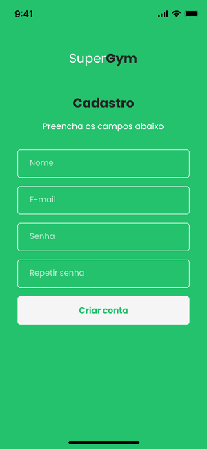

# Projeto de Interface

Visão geral da interação do usuário pelas telas do sistema e protótipo interativo das telas com as funcionalidades que fazem parte do sistema (wireframes).

Desenvolvemos a interface a seguir de modo a cumprir com todas especificações funcionais e não funcionais. Procuramos desenvolver um design moderno porém ao mesmo tempo simples e intuitivo fazendo com que o usuário possa navegar de forma intuitiva e sem complicações. Procuramos escolherer cores com contrastes inversos para melhorar a vizualização do usuário e também deixar o design mais leve. 

## Diagrama de Fluxo

O diagrama apresenta o estudo do fluxo de interação do usuário com o sistema interativo e  muitas vezes sem a necessidade do desenho do design das telas da interface. Isso permite que o design das interações seja bem planejado e gere impacto na qualidade no design do wireframe interativo que será desenvolvido logo em seguida.

As referências abaixo irão auxiliá-lo na geração do artefato “Diagramas de Fluxo”.

## Wireframes

São protótipos usados em design de interface para sugerir a estrutura de um site web e seu relacionamentos entre suas páginas. Um wireframe web é uma ilustração semelhante do layout de elementos fundamentais na interface.

